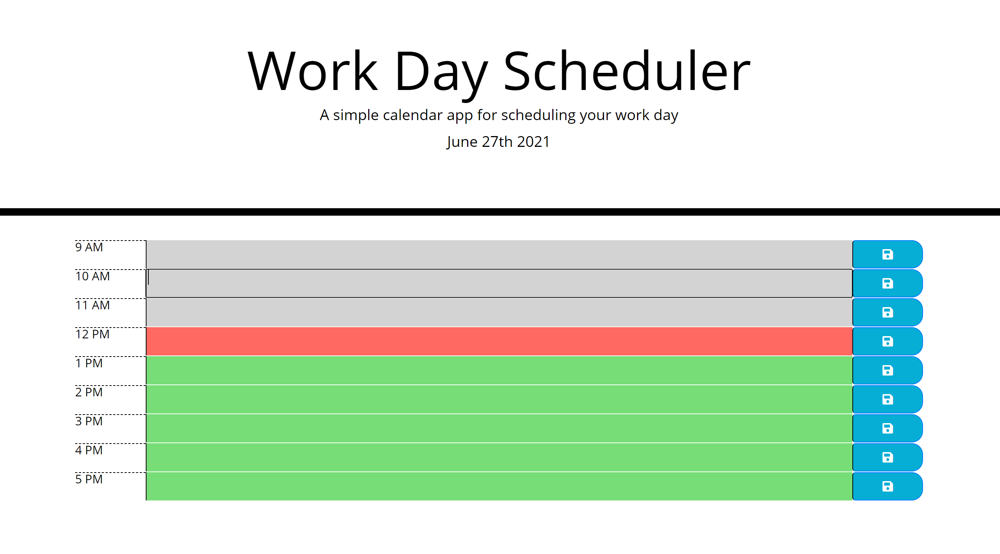

<h1>Workday Scheduler</h1>
<h2>Mariah Eckrich</h2>

Description: This is a simple calendar style application that allows users to plan out their workday to stay organized. The tasks are saved in local storage to be able to refer back to after refresh or page close. This webpage uses moment.js, bootstrap, and jQuery.

User Story:
AS AN employee with a busy schedule
I WANT to add important events to a daily planner
SO THAT I can manage my time effectively

Acceptance Criteria:
GIVEN I am using a daily planner to create a schedule
WHEN I open the planner
THEN the current day is displayed at the top of the calendar
WHEN I scroll down
THEN I am presented with time blocks for standard business hours
WHEN I view the time blocks for that day
THEN each time block is color-coded to indicate whether it is in the past, present, or future
WHEN I click into a time block
THEN I can enter an event
WHEN I click the save button for that time block
THEN the text for that event is saved in local storage
WHEN I refresh the page
THEN the saved events persist

<h2>Screenshot</h2>
 

<h2>Link to deployed application</h2>

 https://meck512.github.io/workdayScheduler/

